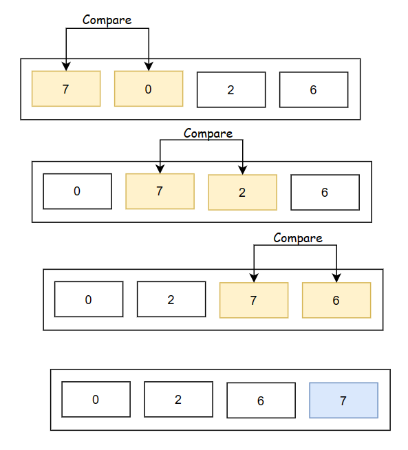
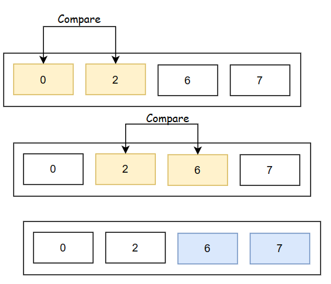
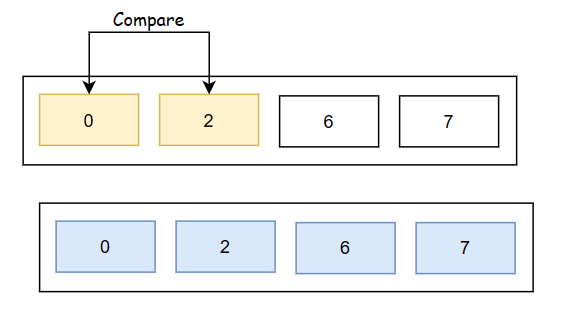

# Bubble Sorting

Bubble Sorting is one of the easiest sorting algorithm which checks adjacent elements (index[0] & index[1], index[1] & index[2]....), and swap them if they are in wrong order. This algorithm is not suitable for large data sets, as its time complexity is quite high.

Bubble Sorting Algorithm :

* compares left element to the adjacent right element and the higher one is place at the right side.
* In this way, the largest element will be moved to the rightmost end.
* This process is continued until the data is sorted.

## Bubble Sorting Visualisation

#### First Phase

----
#### Second Phase

----
#### Third Phase

---