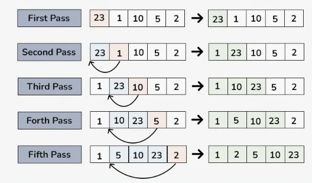

# Insertion Sorting 

Sorting algorithm which works by iteratively inserting each element of the unsorted list into its correct position in the sorted part of the list. It is stable sorting algorithm, whihc means the element with equal values maintain their relative order in the sorted output.

## Insertion Sorting Algorithm

* Starting with the second element of the array. 
* Comparing the second element with the first element and check if the second element is smaller than the first, if yes, swap them.
* Move to third element, compare it with second element, and compare it with first element, and swap the necessary inde of the array to put it in the correct position. 
* Continuing the process untile the whole array is sorted. 

## Insertion Sorting Visualisation

(GeeksforGeeks,2024)
