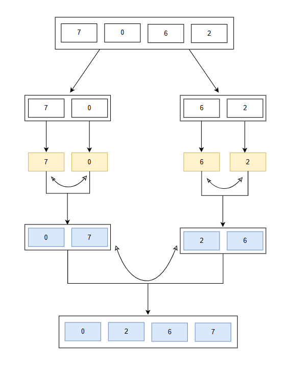

# Merge Sorting

Sorting algorithm that follows divide and conquer approach. It works by recursively dividing the main array into smaller sub array and sorting those sub array then merging them back to obtaing the sorted array. 

## Merge Sorting Algorithm

* Divide: Divide the main array recursivelt into two halves until it can no more be divided.
* Conquer: Each sub array is sorted induvidually using the merge sort algorithm.
* Merge: The sorted subarray are then merged back together in sorted order. The process continues until all the elements in the array is sorted.

## Merge Sorting Visualisation

