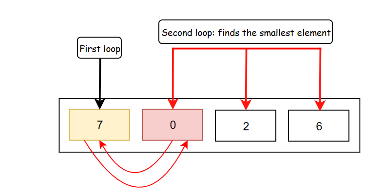
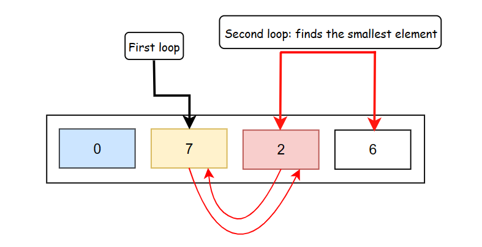
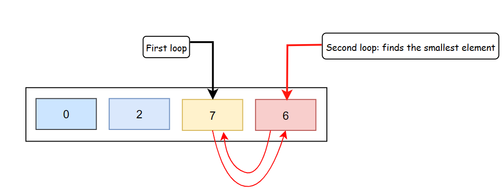
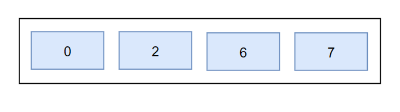

# Selection Sorting 

One of the simple yet effective sorting algorithm that works repeatedly selecting the smallest(or largest) element from the unsorted portion of list and moving it to the sorted portion of the list. 

## Selection Sorting Algorithm 

* The time complexity of Selection Sort is O(N^2) as there will be two nested loops.
* One loop to select element of an array one by one. O(N) 
* Another loop is to find the smallest elment in the unsorted area of array. O(N)
* Finally, total time complexity is O(N) * O(N) = O(N^2)

## Selection Sorting Visualisation   

#### First Phase

#### Second Phase

#### Third Phase

#### Fourth Phase
